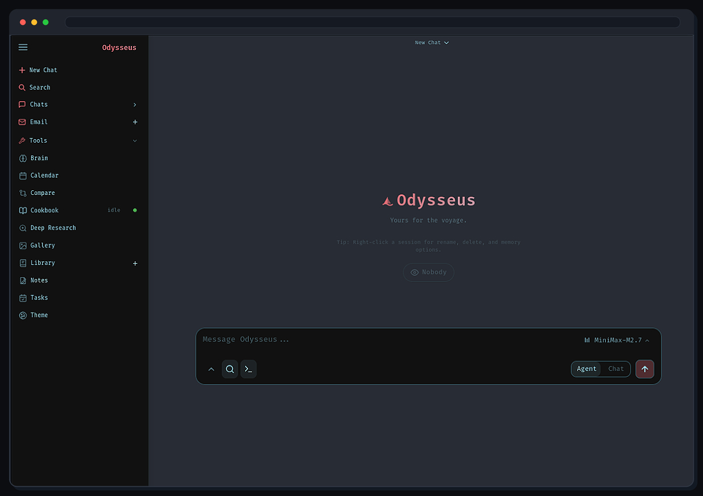

# Outis

> **Downstream fork notice (19 July 2026):** Outis is a modified fork of
> [Odysseus](https://github.com/odysseus-dev/odysseus), initially based on
> Odysseus v1.0.2 (`9844a2f`). It remains licensed under
> [AGPL-3.0-or-later](LICENSE). See [FORK.md](FORK.md) for the product and
> upstream-tracking policy, and [LICENSING.md](LICENSING.md) for the source-offer
> and integration rules.

<p align="center">
  A self-hosted AI workspace and client for chat, agents, research, documents, email, notes, calendar, and externally managed local models.
</p>

<p align="center">
  <a href="#quick-start">Quick Start</a> ·
  <a href="docs/setup.md">Setup Guide</a> ·
  <a href="CONTRIBUTING.md">Contributing</a> ·
  <a href="ROADMAP.md">Roadmap</a> ·
  <a href="https://github.com/corriander/outis">Source</a>
</p>

<p align="center">
  
</p>

---

## Quick Start

`main` is Outis' product and default branch. It starts from a stable upstream
`main` baseline, then carries deliberate Outis changes. Some interface text and
assets still use the Odysseus name while the identity transition proceeds without
a wholesale rebrand.

```bash
git clone https://github.com/corriander/outis.git
cd outis
cp .env.example .env
docker compose up -d --build
```

Open `http://localhost:7000` when the containers are healthy. The first admin password is printed in `docker compose logs odysseus`.

Native installs, GPU notes, Windows/macOS instructions, HTTPS, and configuration live in the [setup guide](docs/setup.md).

## Features

The current feature set is inherited from Odysseus. Outis will preserve useful
workspace primitives while progressively moving model acquisition, profiles,
runtime lifecycle, and other replaceable capabilities behind explicit service
interfaces.

- **Chat + Agents** — local/API models, tools, MCP, files, shell, skills, and memory.
- **Cookbook** — the inherited hardware-aware model browser, extended with
  broad Hugging Face search merged into the same list, over an explicit
  artifact/profile/runtime capability boundary for provider-owned deployments.
- **Deep Research** — multi-step web research with source reading and report generation.
- **Compare** — blind side-by-side model testing and synthesis.
- **Documents** — writing-first editor with AI edits, suggestions, Markdown, HTML, CSV, and syntax highlighting.
- **Email** — IMAP/SMTP inbox with triage, tags, summaries, reminders, and reply drafts.
- **Notes, Tasks + Calendar** — reminders, todos, scheduled agent tasks, and CalDAV sync.
- **Extras** — gallery/image editor, themes, uploads, web search, presets, sessions, and 2FA.

## Demo

A full hover-to-play tour lives on the landing page: [`docs/index.html`](docs/index.html).

## Contributing

Help is welcome. Outis keeps its public issue and pull-request corpus curated,
and contributions should preserve generic interfaces rather than require an
inaccessible private service. See [CONTRIBUTING.md](CONTRIBUTING.md),
[FORK.md](FORK.md), and [ROADMAP.md](ROADMAP.md).

## Security

Outis is a self-hosted workspace with powerful local tools. Keep auth enabled,
keep private data out of Git, and do not expose raw model/service ports
publicly. Deployment details are in the [setup guide](docs/setup.md#security-notes).

## Relationship to Odysseus

Outis tracks Odysseus softly: upstream remains a valuable source of fixes and
features, but Outis is allowed to diverge where its client-first product
boundary requires it. Generic fixes may be prepared for upstream separately.
Outis does not promise drop-in compatibility with every future Odysseus release.
The operational rules are recorded in [FORK.md](FORK.md).

## License

Outis is AGPL-3.0-or-later. The visible **Source** link in the application is
configurable so modified network deployments can identify the corresponding
source for the version they run. See [LICENSE](LICENSE),
[LICENSING.md](LICENSING.md), and [ACKNOWLEDGMENTS.md](ACKNOWLEDGMENTS.md).
